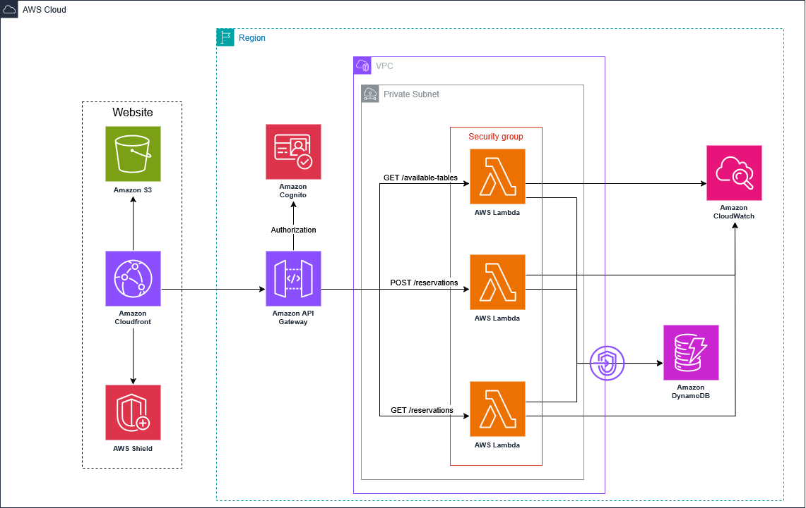

# Book a table

## Description
A table booking application in a restaurant for a given date.

## Features

- Get number of available tables for a given date in real time.
- Book a table for a given date.
- Authentication for users.
- Get list of reservations.

## Architecture


Link to source shcema in [draw.io](https://viewer.diagrams.net/?tags=%7B%7D&lightbox=1&target=blank&highlight=0000ff&edit=_blank&layers=1&nav=1&title=test_app_restaurant.drawio&dark=auto#R%3Cmxfile%3E%3Cdiagram%20name%3D%22Restaurant%20Reservation%20Architecture%22%20id%3D%22a_hx3w03oUDGEo8pQggY%22%3E7Vxbc5s4FP41fnQGIa6Pvma7k85m4m6zferIoNhsMXJAvvXXrwQCI4RdkpjY66bNtHAQAs75vk9Ht3TgYLG9jdFy%2Fpn4OOzomr%2FtwGFH16FmO%2Bw%2FbtllFgAcN7PM4sAXtr1hEvzEwqgJ6yrwcSIVpISENFjKRo9EEfaoZENxTDZysScSyk9dohlWDBMPhar1MfDpPP8My91f%2BAMHs7l4tKPb2YUFyguLL0nmyCebkgmOOnAQE0Kzo8V2gEPuvdwv2X3jA1eLF4txRJvc4N%2Fpq8fp49bYPP%2FpWZ%2B%2FPPSev3Ud8XJrFK7EFz%2FgWUAi8c50lztiSYKIps40%2B%2ByH3TfQOia7MuBnN7pZMVTPbdkA1DNeh2yontuyAVSrB5Xng%2BoLlgzKmVS9Vnm%2BVnpB9gP7ZEXDIMKDAnYaM85i5AcsHAMSkpjZIhIx7%2FXndBGyM8AON%2FOA4skSedyrG8YZZnsiERXAB3p%2BLhzPa2XQpog9KxZ1pJHA8WiNs4BkZcIQLZNgWtwVY28VJ8EaP%2BAkq5xbGQiX%2FHixnXHC3qBNYtzMYrJapq%2F%2FiT2r9ur3OEMFq4HG5AfOv7DDOK71jJ7F3zsIw8qXr3FMA0amXhjMeMWU8OcgcRbiJ8prZO4IotldejaEmnBB6RHAsEf9HrP7KJljX%2FhBJYDgBH8q3pZMghC3mCwwjXesiLjaBUDwWOiTa2Wnmz3X3Zwj8xLNLVsYkdCXWVH3noLsQLDwBYy0ocLI%2BzhYI4qZcbKaRpgq3Ex%2BYOrNRYjfEZmvRlOSfUcNmhzbBW67aCoeUaBJq0XTccFsjDFDMyWI5TWUIGbYNRAzrbYgZhkKxL7eDz4U%2F0PxyxxdLz29lqEDYzwet8rQXq9v951fM%2FTFeq%2FbhsRFAFW9N9w6vddbI6Oq973HCTMMQrLyP0j5QcoyKdnhdy8FRg0z2d8xR16LzCwecWpmdmElEzNVZrJkrYaadmvUtF2FfthnvUNxSmI6JzMSoXC0t%2FZZmCK%2F8My%2BzB3hHk%2BR8y%2BmdCeghlaUyNhsmIjkupGQVezhIwVzv1IUz%2FCxGvOg8W88GrIYh4gySEuhrvN%2BemsvjtGuVEAo2L7me27YI8HVLAkIecI0bljeBGYl8tkb7HFQfMrroZE7VVHtO7SY%2BugVGfohoh0QM4X8T%2BmfCvmZfTS0gaZVGZvLwR2a4vCeJAENMskJfD%2Bs04spoZQsSpLhYa5%2BL5NVrSKrYK85XG8OCeMyJv7Ko5kq9pe18hhmfn8xfZorlG3aMi6BmsjXdRW591vSJ%2Fsq9Mm5CNkBAEIpvtDVOgd1pMHtQoaKF8j0V9xWifwpFMn5UKTfXJGgdXZFsq5CkexWFOnyNCOfnbmOcP1fE1zTvsQE1%2F5oTn7z5sQ0zt2cFMMIJRAu0E8%2BO6kNdxFakGH%2FgpA4cHUzDfl1I9FPPe9P28Sia8tYNJqmNqAtLJrXkdo4Z2sr3%2BR944gSpAPlj4iT%2FnK0YGQD0%2B5fvRakY9Gb1PctqgHQXF2SAz2fUz2bHBj6VciB%2B049Hc2Vezp6dXL7dD2df0Z%2FY%2Ff523oDXOfrdjN6sPRd11TkY8InZgLKPy6beKmGs2YSRWH%2FcAhN%2FtEHpleqU0gVsSnuriOwEnWFLo2BcDjjg5oUFVCzNgHAGl4Zzgl4VRuoQ92OyTzAoX9BAs%2BCZxiDqxf4JPN7iyB0ZAyev9fhXIi0g6YibjTM6YB1UTkdUJchKY7fu%2FUQD0ourFFsacEgir3Jfg7%2BoMNfMGmt58uA8wE8ByjghVodeltbPwj0w5nyBCoOPp%2BA2r0eAMoyvOsTUHgirFmOBDUDqFB7X500L2T0uLFOwqY6qV%2BWTqrJ677vS2ZRwFx0ObT%2BTfIiTzj%2BJNwGhtyM6LAht1vr3uoXsvSpMbetptw2z8Xt2u6OmgL1VsxtcfAT0bpdOPy1Uw7JjlNIUqVTwbOYL0NE%2B%2FWJ8nrS4bFEX2yxEjd3io1Nv%2BwAZGA63LJpNwAY8viAeORrhx3yIuTpKcGtTJ3mDL0%2Bgpx8Oc6bCFKzG%2BavyZcOx96YYRnH65QoyXUwBR5vJ7QbCC15N4n%2BNqLke1SkOruufH97LMpRWZfa9O4%2FsX9vEcUbtLugBKfY%2F3DdCQ5aBt9nwvmtJDmNOzDtTemp4qLKSOT3%2BDZiHqAQJUngyRGSJf099LnpkH3JrWbd9jLtJMphWUCKqpnvqMmryL5cGdhXKrKBXJHhVCo6MEPw0tU3sPocyzr6XtXyEEjl37z6prbVU2c7b0ei0UNrFIS8Zemm7cuVNHzm8TFi7cYAjjz%2B0X1jipiHt9L0gUoN7bV9ZoPhz8tTn6ZLI8%2BjPpZ5IvWxtMtUH8t4B%2FVRR5A7uhXyDWJ%2BsGaHM35YCJKchWflmLlU9EokyviFRFkmdN6G6kKEKhlPeyJk14lQFkOeV0phs55XJL%2FQzTYz9lgBYC23qcPz63nYH%2FGUpcG4hImsygOgYIGir8VDXZ7cUBtf8ssiYHW2R52qtGrEDrY1WX7GQbpKA3C6EfnDqwLONv5es0NbWnv2FJPoNb%2BU46OH%2Bva1Z5nvTzSbW%2BG3oal7kE%2FVQ%2BUNZ%2FGrnzI13%2F8GLTj6Dw%3D%3D%3C%2Fdiagram%3E%3C%2Fmxfile%3E).

## Installation
1. Clone the repository:
    ```bash
    git clone https://github.com/BuBu-IBA/u_table_reservation.git
    ```
2. Navigate to the project directory:
    ```bash
    cd u_table_reservation
    ```
3. Initialization
    ```bash
    terraform init
    ```
4. Plan
    ```bash
    terraform plan
    ```
5. Deployment
    ```bash
    terraform deploy
    ```
